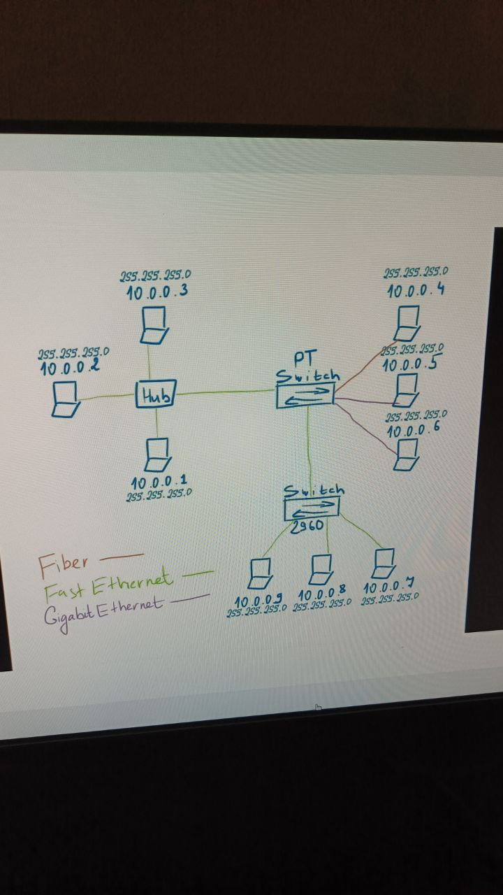

# Урок 1. Основы компьютерных сетей. Ethernet. Работа в программе в Cisco Packet Tracer
Перенести схему, которая указана на изображении ниже

   

 # Lesson 1. Fundamentals of computer networks. Ethernet. Working in the Cisco Packet Tracer program
Transfer the scheme shown in the image below

   