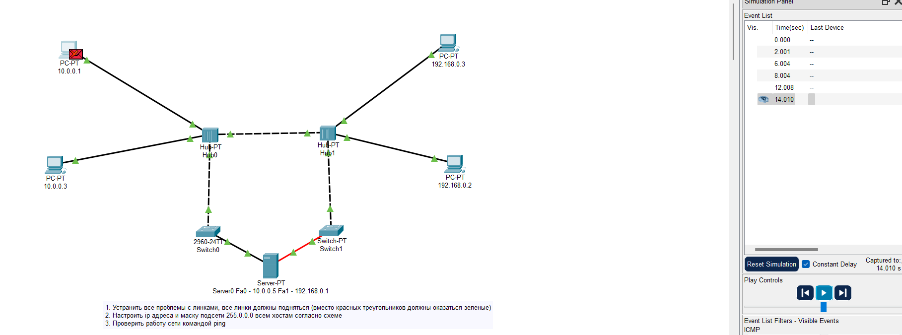
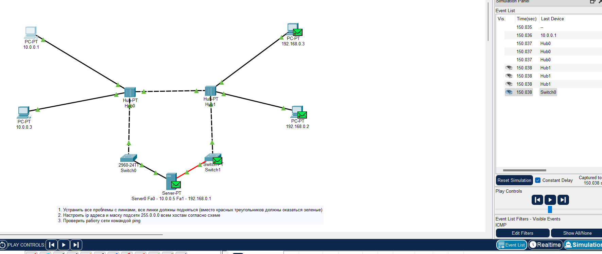
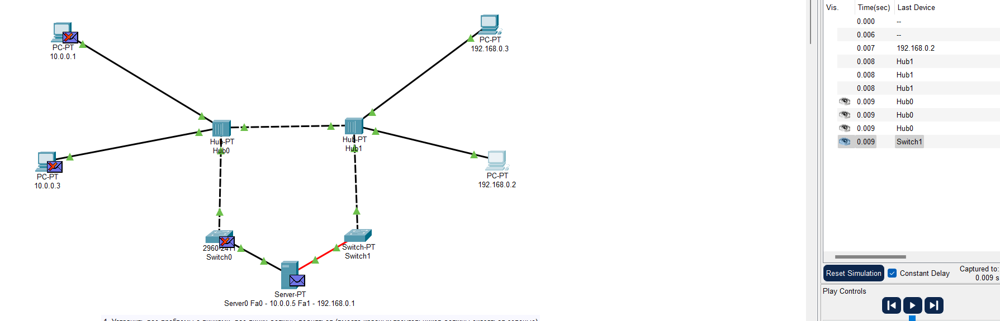

# Урок 1. Основы компьютерных сетей. Ethernet. Работа в программе в Cisco Packet Tracer

1. Починить сеть из файла https://disk.yandex.ru/d/pxY6JoEJ8AHhew), чтобы все линки были зеленые. Попинговать компьютеры.
2. Сдать два скриншота успешного пинга с РС 10.0.0.1 на интерфейс сервера Fa0 10.0.0.5 и на PC 10.0.0.2.
3. Сдать один скриншот успешного пинга с РС 192.168.0.2 на интерфейс сервера Fa1 192.168.0.1

## Решение
1. 
 пинг с 10.0.0.1 на 10.0.0.2

2. 
 пинг с 10.0.0.1 на 10.0.0.5

3. 
 ping с 192.168.0.2 на 192.168.0.1

# Lesson 1. Fundamentals of computer networks.  Ethernet. Working in the Cisco Packet Tracer program

1. Fix the network from a file https://disk .yandex.ru/d/pxY6JoEJ8AHhew ), so that all links are green. Ping computers.
2. Submit two screenshots of a successful ping from PC 10.0.0.1 to the server interface Fa0 10.0.0.5 and PC 10.0.0.2.
3. Submit one screenshot of a successful ping from PC 192.168.0.2 to the server interface Fa1 192.168.0.1

## Solution
1. 
 ping from 10.0.0.1 to 10.0.0.2

2. 
 ping from 10.0.0.1 to 10.0.0.5

3. 
 ping from 192.168.0.2 to 192.168.0.1